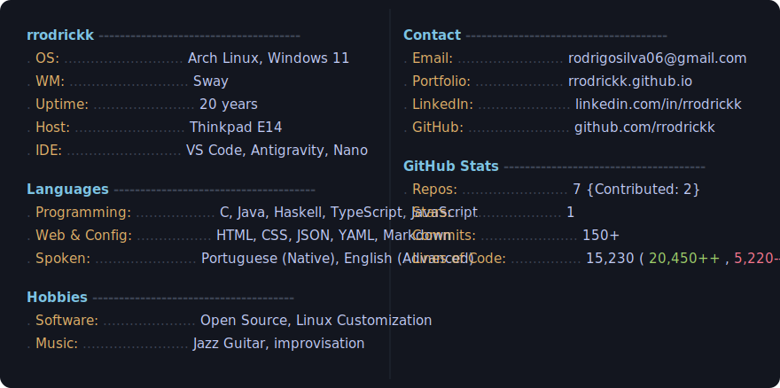

# rrodrickk

<picture>
  <source media="(prefers-color-scheme: dark)" srcset="./profile-ascii.svg">
  <source media="(prefers-color-scheme: light)" srcset="./profile-ascii.svg">
  
</picture>

<picture>
  <source media="(prefers-color-scheme: dark)" srcset="./profile-info.svg">
  <source media="(prefers-color-scheme: light)" srcset="./profile-info.svg">
  
</picture>
